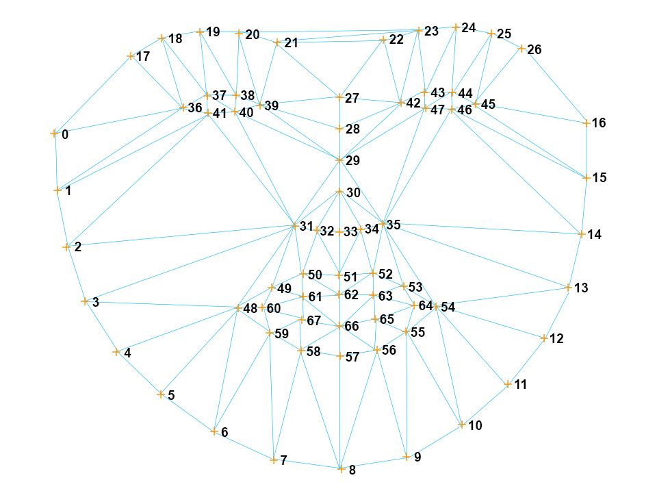

<div align="center">
  <p>With support from <a href="https://glitch.com">Glitch.com</a>, the <a href="https://www.cmu.edu/cfa/studio/index.html">STUDIO at CMU</a>, and you.</p>
  
  <h1>Handsfree.js</h1>
  <p>A platform for creating handsfree user interfaces, tools, games, and experiences for the web and IoT 🤯</p>
  <p>Powered by <a href="https://github.com/Tastenkunst/brfv4_javascript_examples">BRFv4</a> and <a href="https://github.com/tensorflow/tfjs-models/tree/master/posenet">PoseNet</a></p>
<p>
    
  
</p>
<p>
    
</p>
<p>
   
</p>
<p>
  
  
</p>
</div>

## License
> Please read the EULA ([eula.txt](eula.txt)) carefully before using Handsfree.js, which depends on [BRFv4](https://www.beyond-reality-face.com/). Once you decide to use handsfree.js commercially, you will need a separate license agreement from them that you must agree to. You can try handsfree.js free of charge to evaluate if it fits your projects' needs. Once you decided to use BRFv4 in your project, contact Taskenkunst for a commercial license: [http://www.tastenkunst.com/#/contact](http://www.tastenkunst.com/#/contact)


# `/handsfree.js/`

`handsfree.js` is a drop-in library that uses computer vision to help you create head-tracked experiences. You can find the library in `/handsfree.js/`, with the entry point being `/handsfree.js/Handsfree.js`. This file adds a global `Handsfree` class to your project.

`handsfree.js` works using plugins though, so you most likely don't need to edit these files. In fact, the fastest way to get started building with handsfree.js is via CDN!

## Quickstart
Choose one of the following `<script>`'s to add to your HTML page, which will add a `Handsfree` global class:

```html
<body>
  <!-- Latest with bug fixes (Recommended for production) -->
  <script defer async src="https://unpkg.com/handsfree@<3.1/dist/handsfree.js"></script>

  <!-- Latest with bug fixes and new features (Recommended for development) -->
  <script defer async src="https://unpkg.com/handsfree@<4/dist/handsfree.js"></script>

  <!-- Latest with potential backwards incompatability (Recommended for testers) -->
  <script defer async src="https://unpkg.com/handsfree/dist/handsfree.js"></script>
</body>
```

You can also include it via NPM:

```javascript
// From the terminal in the project root, type:
npm i handsfree

// Then inside your Node project:
import Handsfree from 'handsfree'
```

 Then **in both cases**, you'll then need to instantiate a Handsfree controller:

```js
// Start settings for your app
const config = {debug: false, settings: {}}
// Instantiate Handsfree
const handsfree = new Handsfree(config)
// Turn on webcam and start tracking
handsfree.start()
```

## Config
There are a number of ways to configure Handsfree.js, the easiest being during instantiation. Here are the available configs and their defaults as of [this release](https://github.com/labofoz/handsfree.js/releases):

```js
const handsfree = new Handsfree({
  // Whether to show (true) the "debugger" or not (false)
  // - For now the debugger is a simple canvas that shows a wireframe over tracked poses
  // - You can toggle the debugger later with handsfree.toggleDebugger(true|false)
  debug: false,

  // Whether to hide the cursor (true) or leave it visible (false)
  hideCursor: false,

  // Available settings
  // - You can change any of these later with: handsfree.settings['settingName'] = newVal;
  settings: {
    // Maximum number of poses to track
    maxPoses: 1,

    sensitivity: {
      // A factor to adjust the cursors move speed by
      xy: 0.7,
      // How much wider (+) or narrower (-) a smile needs to be to click
      click: 0
    },
    
    stabilizer: {
      // How much stabilization to use: 0 = none, 3 = heavy
      factor: 1,
      // Number of frames to stabilizer over
      buffer: 30
    },

    // Sets up the webcam
    webcam: {
      video: {
        width: 640,
        height: 480
      }
    },

    tracker: {
      // PoseNet
      // @see https://github.com/tensorflow/tfjs-models/tree/master/posenet
      posenet: {
        // @todo Make these comments more succinct
        // The float multiplier for the depth (number of channels) for all convolution operations.
        // - The value corresponds to a MobileNet architecture and checkpoint
        // - The larger the value, the larger the size of the layers, and more accurate the model at the cost of speed
        // - Set this to a smaller value to increase speed at the cost of accuracy.
        // - Possible values [0.5, 0.75, 1.0, 1.01]
        multiplier: 0.75,
        // A number between 0.2 and 1.0 representing what to scale the image by before feeding it through the network
        // - Set this number lower to scale down the image and increase the speed when feeding through the network at the cost of accuracy.
        imageScaleFactor: 0.4,
        // The minimum overall confidence score required for the a pose/person to be detected.
        minPoseConfidence: 0.1,
        // The minimum confidence score for an individual keypoint, like the nose or a shoulder, to be detected.
        minPartConfidence: 0.5,
        // the desired stride for the outputs when feeding the image through the model.
        // - The higher the number, the faster the performance but slower the accuracy
        // - Possible values [8, 16, 32]
        outputStride: 16,
        // Non-maximum suppression part distance
        // - It needs to be strictly positive
        // - Two parts suppress each other if they are less than nmsRadius pixels away
        nmsRadius: 20,
        // Only return instance detections that have root part score greater or equal to this value.
        scoreThreshold: 0.5
      }
    }
  }
})
```

## API

The following methods are available on your `handsfree` instance:

```js
// Starts a webcam stream, shows the debugger if active, and starts tracking
// - Also triggers the onStart event of enabled plugins
handsfree.start()

// Closes the webcam stream, hides the debugger, and stops tracking
// - Also triggers the onStop event of enabled plugins
handsfree.stop()

// Toggles the debugger on (true), off (false), or flips the state (null)
handsfree.toggleDebugger(true|false|null)

// Toggles the cursor on (true), off (false), or flips the state (null)
// - You'll still be able to click (disable the SmileClick plugin to disable this)
handsfree.toggleCursor(true|false|null)
```

Changing settings is done with:

```js
handsfree.settings['path']['to']['setting'] = newVal
```

## Plugin Development

Handsfree makes heavy use of plugins, allowing you to extend Handsfree.js without modifying the core library!

To add a plugin, use the `handsfree.use({})` method with the following signature. Calling `use()` with the same `.name` overwrites that plugin (this lets you easily prototype in your browser's debug console).

Finally, this method returns a reference to the plugin:

```js
const myPlugin = handsfree.use({
  // Must be unique (spaces and special characters are fine)
  // - Using the same name as an existing one overwrites it
  name: '',

  // The plugins execution priority
  // - Lower numbers run before higher numbers
  // - Numbers can be negative and fractional
  priority: 10,

  // Set to true to have this plugin disabled by default
  // - Disabled plugins do not run any of their hooks
  _isDisabled: false,

  // Called once when the plugin is first added to handsfree with handsfre.use({})
  onUse: (handsfree) => {},

  // Called once per frame, after all calculations
  // - {Array} poses  Reference to the handsfree.pose
  // - {Return}       To overwrite/modify the properties of handsfree.pose for use within other plugins, return an array with modifications
  onFrame: (poses, handsfree) => {},

  // Called any time Handsfree.start() is called
  onStart: (handsfree) => {},

  // Called any time Handsfree.stop() is called
  onStop: (handsfree) => {},

  // Called when .disable() is explicitely called on this plugin
  onDisable: (handsfree) => {},

  // Called when .enable() is explicitely called on this plugin
  onEnable: (handsfree) => {},

  // Called the first frame a click
  onMouseDown: (pose, poseIndex) => {},

  // Called every frame after a click and is still in "click mode"
  onMouseDrag: (pose, poseIndex) => {},

  // Called after a click release
  onMouseUp: (pose, poseIndex) => {}
})
```

Additionally, every plugin has a `.disable()` and an `enable()` method, which sets the `._isDisabled` flag to either true or false. These methods also fire the plugins `onDisable()` and `onEnable` hooks if they were provided:

```js
handsfree.plugin['my-plugin'].disable() // handsfree.plugin['my-plugin']._isDisabled === true
handsfree.plugin['my-plugin'].enable() // handsfree.plugin['my-plugin']._isDisabled === false
```

## `poses` array

The `onFrame` hook recieves a `poses` array, which contains an object with the following API (note that there is always at least one pose):

```js
poses[0] = {
  /**
   * A BRFv4 tracked face
   * @see https://tastenkunst.github.io/brfv4_docs/#hl_BRFFace
   */
  face: {
    cursor: {
      // Where to position the cursor on the screen, based on the users head pose
      x: 0,
      y: 0,

      // The HTML element currently under the above {x, y}
      $target: 0,

      // Cursor states for this face
      // - These states are activated via the Click Gesture,
      //   which is currently done by smiling wide
      state: {
        // True during the first frame of a click, false after (even if still held)
        mouseDown: false,
        // True after the first frame of a click and every frame until released
        mouseDrag: false,
        // True on the last frame of a click, immediately after the click is released
        mouseUp: false
      }
    },

    // A list of all 64 landmarks
    // - points[27] refers to the point between the eyes
    points: [{x, y}, ...],

    // The head's pitch (facing up/down)
    rotationX: 0,
    // The head's yaw (facing left/right)
    rotationY: 0,
    // The head's roll (think of an airplane doing a barrel roll)
    rotationZ: 0,

    // The overall size of the head relative to the video frame
    // - smaller values == further away
    // - larger values == close up
    scale: 0,

    // Where the head is relative to the left edge of the video feed
    // - 0 == left
    // - window.innerWidth == right
    translationX: 0,
    // Where the head is relative to the top edge of the video feed
    // - 0 == top
    // - window.innerHeight == bottom
    translationY: 0
  }
}
```

There are 64 landmark points, reflected in the following image: 



## Events
### handsfree:trackPoses `since v4.0.0`
An alternative to plugins is to listen in on the window's `handsfree:trackPoses` event:

```js
/**
 * Bind to the handsfree:trackPoses event
 * @param {Handsfree} ev.detail.scope The handsfree instance
 * @param {Array}     ev.detail.poses Collection of pose objects
 */
window.addEventListener('handsfree:trackPoses', (ev) => {
  // Do code with the handsfree instance: ev.detail.scope
  // or with the the pose: ev.detail.pose
})
```

### handsfree:loading
The BRFv4 model is around 9Mb, so this helper helps give your users feedback! This event is called for every downloaded chunk, with the progress expresses as %XXX.XX

```js
/**
 * Called for every chunk while BRFv4 is loading
 * - Good for showing load progress
 */
window.addEventListener('handsfree:loading', (ev) => {
  const progress = ev.data.progress
})
```

### handsfree:ready
Called after handsfree has been instantiated. Listen to this event to do things like enable `[onclick="handsfree.start()"]` buttons, advance a loading screen, and more!

```js
/**
 * Called after handsfree is instantiated and ready to be used
 * - Models are loaded and ready to be used
 * - Use this to enable a [onclick="handsfree.start()"]
 * - Also good for ending a loading screen
 */
window.addEventListener('handsfree:ready', () => {
  // do stuff when handsfree is ready
})
```

### handsfree.mouseDown
```js
/**
 * Called the first frame that a face clicks
 */
window.addEventListener('handsfree:mouseDown', (ev) => {
  const face = ev.detail.face
  const faceIndex = ev.detail.faceIndex

  // Do things with face and faceIndex here
})
```

### handsfree.mouseDrag
```js
/**
 * Called every frame after a face clicks and is still in "click mode"
 */
window.addEventListener('handsfree:mouseDrag', (ev) => {
  const face = ev.detail.face
  const faceIndex = ev.detail.faceIndex

  // Do things with face and faceIndex here
})
```

### handsfree.mouseUp
```js
/**
 * Called when a face releases a click
 */
window.addEventListener('handsfree:mouseUp', (ev) => {
  const face = ev.detail.face
  const faceIndex = ev.detail.faceIndex

  // Do things with face and faceIndex here
})
```

## Dispatching Events
You can use `handsfree.dispatch(eventName)` to trigger events. This helper is the equivalent of using `window.dispatchEvent()`. One thing to note is that eventNames are namespaced with `handsfree:`, for instance:

```js
// This...
handsfree.dispatch('SimpleKeyboard:change', 'abc')

// ...and this are equivalent
window.dispatchEvent(new CustomEvent('handsfree:SimpleKeyboard:change'), {
  detail: 'abc'
})
```

## Classes
The document body contains `.handsfree-stopped` when handsfree is stopped (this includes when it's been initialized but not started), and `.handsfree-started` when it's on. This lets you quickly hide, show, and style elements based on the state of handsfree.

## Visual Debugging

The debugger is loaded into the first element in the DOM with the `.handsfree-debug-wrap`. If one doesn't exist, then it's added as the last root element of `body`. You should rarely need to debug visually, and it's preferred that you don't draw into this canvas at all as it's used by the BRFv4 model for inferring your head pose.


# `/src/`

This is where [handsfree.js.org](https://handsfree.js.org) lives and is a good place to prototype quickly. I'll leave more instructions for this workflow soon.

## Workflows
### Handsfree YouTube

**Source:** `/src/components/youtube/`

**Preview:** https://handsfree.js.org/#/youtube

**Starter Kit:** https://glitch.com/~handsfree-youtube


## Building Prereqs
- [NodeJS](https://nodejs.org/en/)

## Scripts
Run the following from projects root directory:

``` bash
# Install dependencies
npm install

# Start a server with hot-reload at localhost:3000
npm run serve

# Test the library (not the documentation site)
npm run test

# Build for production
npm run build

# Build and deploy (see /deploy.js to configure for your own server)
npm run deploy
```

For detailed explanation on how things work, check out the [Vuetify.js](https://vuetifyjs.com/) and [CLI Plugin](https://github.com/vuetifyjs/vue-cli-plugin-vuetify) documentation.

## Development Notes

- The main Vue instance is available on `window.App`
- The main vuex store then is available on `window.App.$store`

### Actions

The following is a set of actions available:

```js
/**
 * Calls the passed function either when window.handsfree is available, or immediately if it's ready
 * - Think of this as window.addEventListener('load') but for the handsfree instance
 * 
 * - Use this inside the Mount component life cycle to disable plugins
 * -- @see https://vuejs.org/v2/guide/instance.html#Lifecycle-Diagram
 * 
 * - Also use it on the beforeRouteLeave vue-router guard
 * -- @see https://router.vuejs.org/guide/advanced/navigation-guards.html#in-component-guards
 */
App.$store.dispatch('onReady', () => {})
```

---

## Deprecated/Renamed Methods
### handsfree.settings.maxPoses => .maxPoses
Since we're now dealing with whole pose objects instead of face objects, it makes sense to rename this setting to reflect that.

## Deprecated Events
The following events are still being used but will be deprecated after the (shown) release version:

- `handsfree-trackfaces` (4.0.0)
- `handsfree-injectDebugger` (4.0.0)

---

# More coming soon

- [@Labofoz](https://twitter.com/labofoz)
- [handsfree.js.org](https://handsfree.js.org)

## Thanks for trying out Handsfree.js!
**March 4th 2018**: https://twitter.com/LabOfOz/status/970556829125165056

